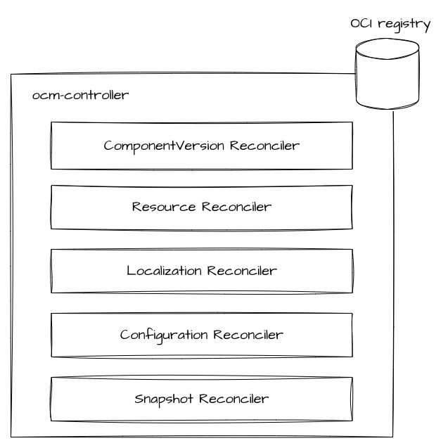
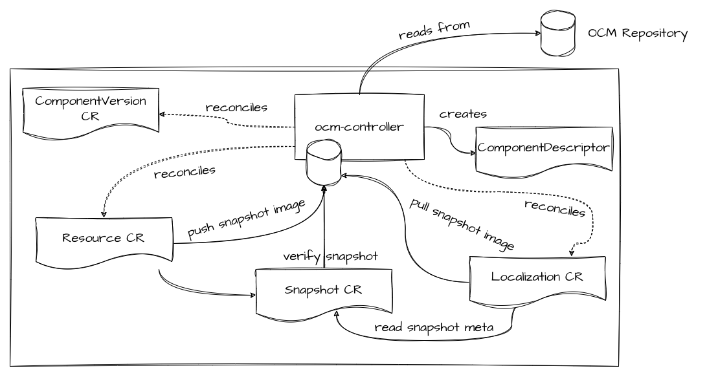

# ocm-controller

[](https://api.reuse.software/info/github.com/open-component-model/ocm-controller)

Main repository for ocm-controller.

## Architecture

The `ocm-controller` manages multiple Custom Resources and therefore contains several reconcilers. It also provides an OCI registry used to cache blobs and make them accessible to clients within the cluster. 



The `ocm-controller` is responsible for the core work necessary to utilise resources from an `OCM` component in a Kubernetes cluster. This includes:
- Resolving [`ComponentDescriptor`](https://github.com/open-component-model/ocm-spec/blob/main/doc/glossary.md#component-descriptor) metadata for a particular [component version](https://github.com/open-component-model/ocm-spec/blob/main/doc/glossary.md#component-version)
- Performing authentication with [OCM repositories](https://github.com/open-component-model/ocm-spec/blob/main/doc/glossary.md#component-repository)
- Retrieving [artifacts](https://github.com/open-component-model/ocm-spec/blob/main/doc/glossary.md#artifact) from OCM repositories
- Making individual resources from the OCM component available within the cluster
- Performing localization and configuration

Snapshots are used to pass blobs between controllers and snapshots are stored in the internal registry managed by the `ocm-controller`.



## Testing

In order to test, run the manager locally with a kind cluster present on the system.

- apply all CRDs from the crd/base folder
- run the controller:

```console
make
./bin/manager -zap-log-level 4
```

- apply all the sample objects

To trigger the `reconcile` loop ( because manually updating the status doesn't trigger it ) run something like this:

```console
kubectl annotate --overwrite ... "trigger/reconcile=$(date -u+%)"
```

## Licensing

Copyright 2022 SAP SE or an SAP affiliate company and Open Component Model contributors.
Please see our [LICENSE](LICENSE) for copyright and license information.
Detailed information including third-party components and their licensing/copyright information is available [via the REUSE tool](https://api.reuse.software/info/github.com/open-component-model/ocm-controller).
